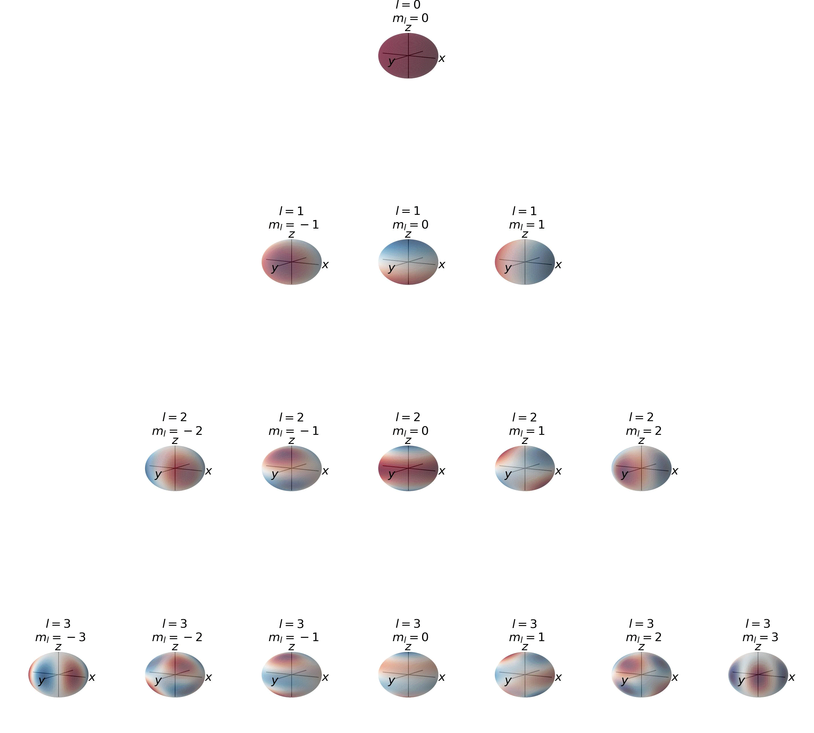
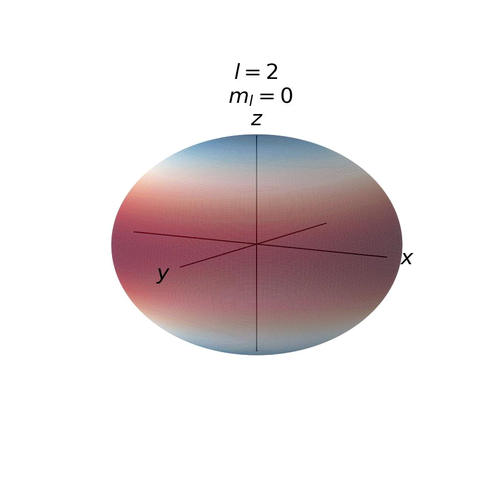
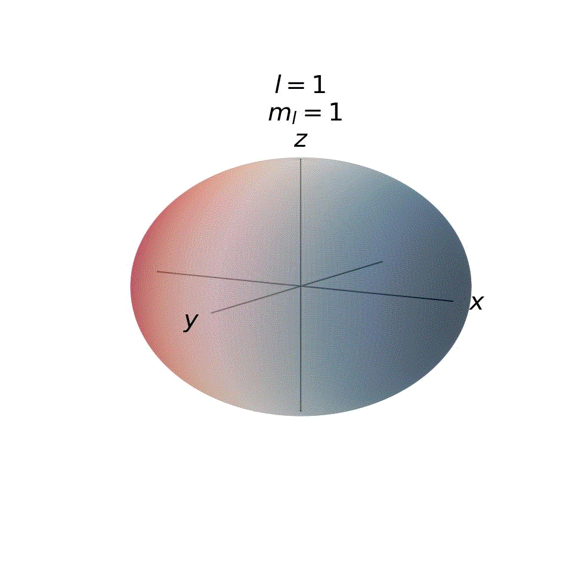
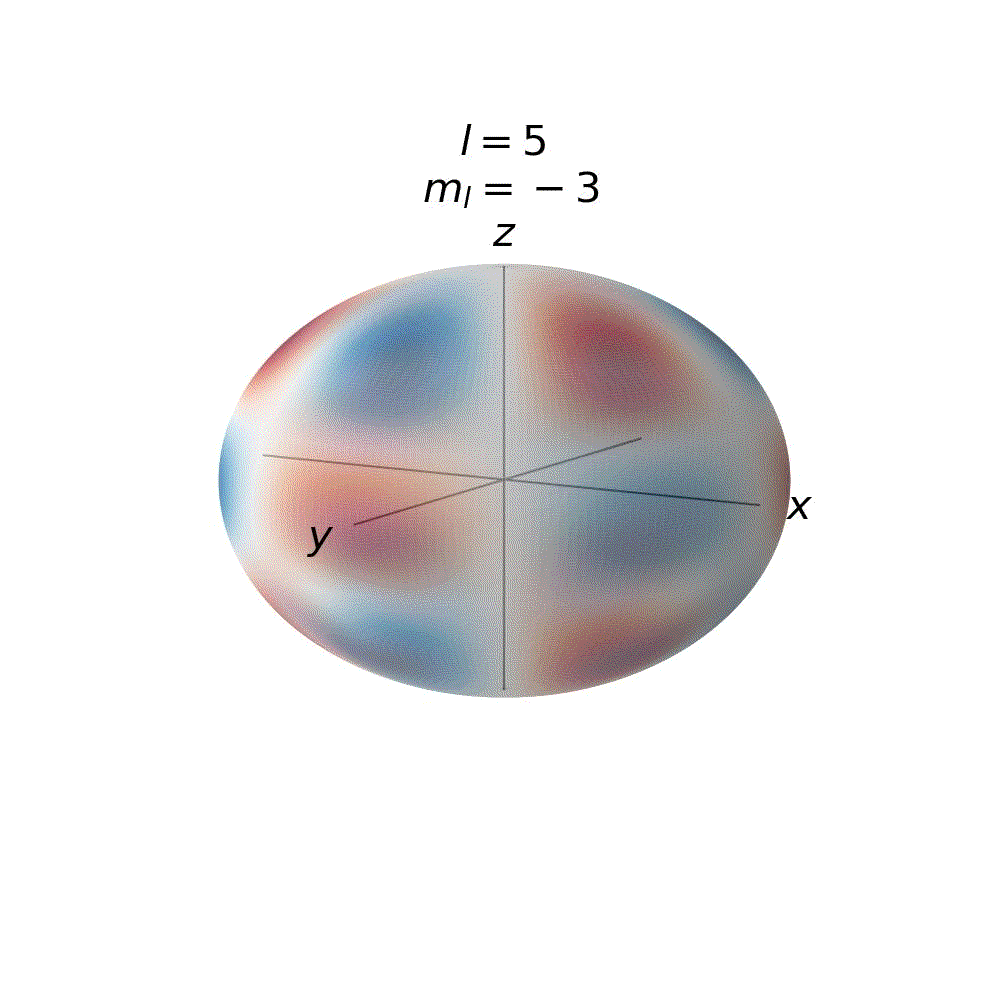

# Orbital Visualization

`orbitals.py` plots the real form of the spherical harmonics associated with quantum treatments of both the rigid rotator and the hydrogenic atom.
There are three options for views:

* `sphere` - A standing wave on a sphere. The common way to represent the wave function solutions of the rigid rotator.
* `orbital` - The distance from the origin, r, is proportional to the magnitude of the spherical harmonic. The common way to represent the angular solutions of a hydrogenic atom.
* `animation` - Visualize the transition between the `sphere` and `orbital` views

## Examples

